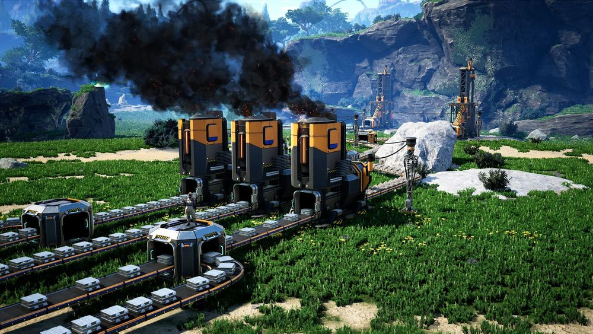
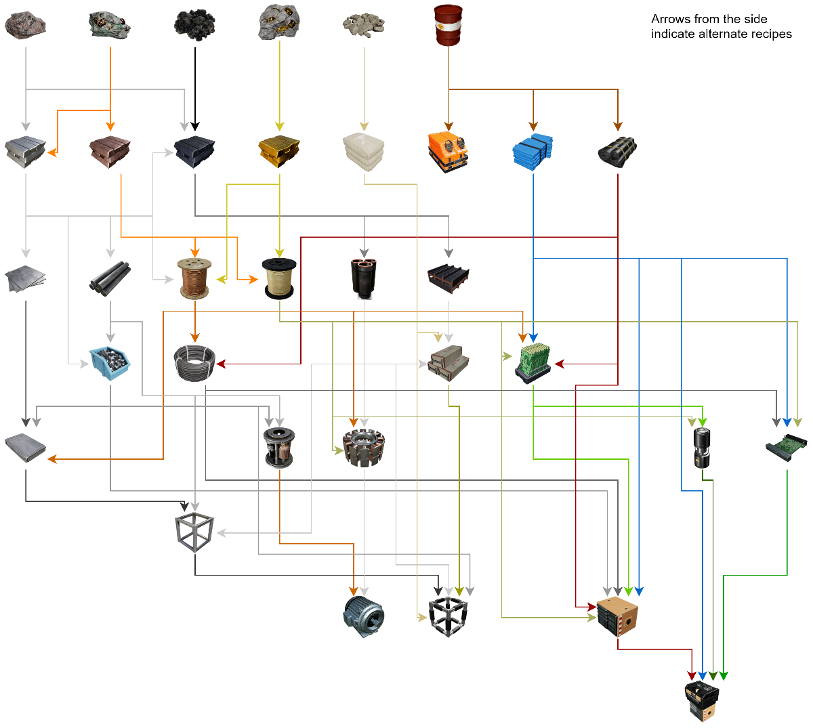
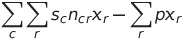
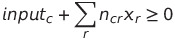

# Satisfactory Optimizer
This project uses Google's [OR-Tools](https://developers.google.com/optimization) to find optimal production ratios 
in [Satisfactory](http://www.satisfactorygame.com).

Data taken from [SatisfactoryTools](https://github.com/greeny/SatisfactoryTools/tree/dev/data)

## Satisfactory
Satisfactory is a game of automation.
You start by building machines to extract raw resources, then you combine resources and items into increasingly complex products.
A Miner produces Iron Ore, and then a Smelter turns Iron Ore into Iron Ingots etc.


[source](https://www.satisfactorygame.com)

## Recipes
Each construction machine takes input items and creates new items based on a specified recipe.
For example, the default Iron Ingot recipe turns 30 Iron Ore into 30 Iron Ingots every minute.  

More advanced items can have up to four input items, and each recipe has unique input/output ratios, speeds, and by-products to consider.
Here's a chart showing the steps to build a late-game item.  


[source](https://www.reddit.com/r/SatisfactoryGame/comments/b7zv8h/satisfactory_production_flowchart_with_alternate/)

Quite a lot to remember when building a factory!  

## Alternate Recipes
To add even more complexity, many items have alternate recipes that may boost production depending on which starting resources are more plentiful.
For example, there are three Iron Ingot recipes:  
- Iron Ingot: 30 Iron Ore to 30 Iron Ingots  
- Pure Iron Ingot: 35 Iron Ore and 20 Water to 65 Iron Ingots  
- Iron Alloy Ingot: 20 Iron Ore and 20 Copper Ore to 50 Iron Ingots  

Which recipe is the best? It depends on which resources are nearby.
If you have excess water/copper and a shortage of iron, then the alternates will help.  

This Satisfactory Optimizer takes all alternate recipes into account and gives an optimal factory setup based on your available materials.

## Usage
Load recipes from the data file. For simplicity this example only uses default recipes. 
```
recipes = load_recipes()
default_recipes = [r for r in recipes if not r.alternate]
```

Specify the available resources in units/minute.  
```
inputs = {
    "Iron Ore": 60
}
```

Give a positive score to components you want to create.
```
outputs = {
    "Reinforced Iron Plate": 1
}
```

Run the optimizer
```
optimizer = Optimizer(default_recipes, inputs, outputs)
optimizer.optimize()
```

Then run
```
python satisfactory.py
```

Output:
```
Solution:
Objective value: 4.93

Recipes Used:
Iron Ingot: 2.00
Reinforced Iron Plate: 1.00
Iron Plate: 1.50
Iron Rod: 1.00
Screw: 1.50

Inputs Remaining:
Iron Ore: 0.00

Produced Components:
Reinforced Iron Plate: 5.00
```
`Recipes Used` shows how many machines need to run each recipe.  
`Inputs Remaining` shows which resources run out first and limit production.  
`Produced Components` shows all the produced components, not just those with a score.

## Linear Optimization
I modelled the recipe production ratios as a [linear programming](https://www.analyticsvidhya.com/blog/2017/02/lintroductory-guide-on-linear-programming-explained-in-simple-english/) problem.  
A linear programming problem consists of _decision variables_, _constraints_, and an _objective function_.  
The optimizer modifies the decision variables to maximize the objective function while satisfying its constraints.

### Decision Variables
We need to know how many machines should produce each recipe.
Therefore, the recipe assignments are the decision variables.  

x<sub>r</sub> = # of machines producing recipe _r_

x<sub>r</sub> is a non-negative real number.

### Objective Function
We want to create as many desirable products as possible, so the objective function is the score of each component multiplied by the total produced.
In order to eliminate extraneous recipes that don't contribute to the final score, each recipe incurs a small penalty.  



where s<sub>c</sub> is the score for component _c_, n<sub>cr</sub> is the quantity of _c_ produced by a single machine with recipe _r_, and _p_ is a small, positive penalty.  
n<sub>cr</sub> will be negative if _r_ consumes _c_ as an input.

### Constraints
For this problem, the only constraint is that each component has a non-negative quantity, otherwise the optimizer could use recipes without having prerequisite materials.   

For each component _c_,  



where input<sub>c</sub> is the specified input amount for component _c_.

## Potential Improvements
- Warnings when input/output components are misspelled
- Include energy costs in objective function